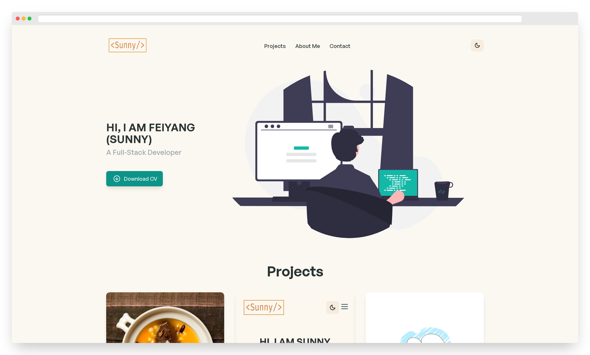

<h2 align="center">
    Portfolio Website with Vue.js & Darkmode<br/>
    <a href="https://sunnyguan.netlify.app" target="_blank">Demo</a> <br/>
    <a href="https://github.com/sunnynano/react-portfolio" target="_blank">React version Repo</a>
</h2>
<div align="center">
     
</div>
<br/>
<div align="center">
     &nbsp;
     &nbsp;
    
</div>
<br/>

## Features

**📖 Multi-Page Layout**

**🎨 Styled with TailwindCSS with easy to customize colors**

**📱 Fully Responsive**

**🌙 Theme Switcher with Dark Mode**

**🧈 Smooth transitions and scroll**

**🔼 Scroll to top button**

**⬇️ Download file button**

## Built With

This project was built using these technologies.

- [Vue.js v3](https://vuejs.org)
- [Vue Router](https://router.vuejs.org)
- [Tailwind CSS v3](https://tailwindcss.com)
- HTML5
- CSS3

## Getting Started

Clone down this repository. You will need [node.js and npm](https://nodejs.org/en/) and [git](https://git-scm.com/) installed on your machine.

## 🛠 Installation and Setup Instructions

1. #### Clone this repo:

```
git clone https://github.com/sunnynano/vue-portfolio.git
```

2. #### Open the project folder:

```
cd vue-portfolio
```

3. #### Install packages and dependencies:

```
npm install
```

4. #### Start a local dev server at `http://localhost:8080`:

```
npm run serve
```

The app wil be in the development mode.\
Open [http://localhost:8080](http://localhost:8080) to view it in the browser.
The page will reload if you make edits.

## Known Issues

1. For iOS and iPadOS users, please visit the site via Safari browser.
   Chrome browser on iOS and iPadOS may experience ["sticky hover" problem](https://css-tricks.com/solving-sticky-hover-states-with-media-hover-hover/).
